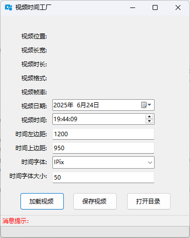

# 视频时间工厂
## 此工具可以快速给视频添加时间戳
## 使用方法
### 在运行目录下创建ffmpeg文件夹并将ffmpeg.exe放在ffmpeg文件夹的bin目录下
目录结构如下：
```
./ffmpeg/bin/ffmpeg.exe
./ffmpeg/bin/ffprobe.exe
./ffmpeg/bin/ffplay.exe
./output/  # 输出目录
./视频时间工厂.exe
./视频时间工厂.deps.json
./视频时间工厂.dll
./视频时间工厂.runtimeconfig.json
```
我使用的ffmpeg版本为 N-109957-g373ef1c4fa-20230302，其他的版本未测试过

# 软件界面
-----------
